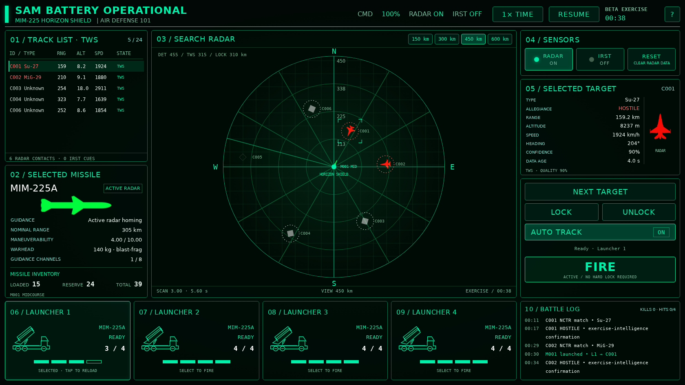

# AIR DEFENSE 101 — fresh beta rebuild

Offline Android radar-defense game rebuilt from the [Google Doc guide](https://docs.google.com/document/d/170pFAgDHbSvsvS7WbFxBIpvjbH0DjT8GjzXJBw4zvy4/edit). The full source Google Docs are excluded from this public backup. The original supplied artwork is preserved in `reference-assets/`; optimized copies are in `web/assets/`.

[Download the signed beta APK](releases/Air-Defense-101-Beta-v0.2.1.apk)

Requires Android 8 or later and an updated Android System WebView. Landscape interface. No network permission, ads, account, or external dependency at runtime. Package ID: `com.prime.airdefense.beta`.



## Play

Start the beta exercise. Wait for two radar sweeps to build TWS tracks. Select a contact on the radar, in the TWS list, or with NEXT TARGET. Select a ready launcher, then FIRE. MIM-225A is active radar homing and needs a usable track within its nominal envelope; it does **not** need a hard lock. Use time acceleration for long-range missile flights. Two missiles may be needed for a glancing hit. Keep checking the battle log and channel count.

Tap the selected launcher again to reload early; empty launchers reload automatically. The exercise lasts 12 simulation minutes, or until four aircraft attacks hit the battery. It starts with six aircraft and adds attackers over time. Only Su-27, MiG-29, MiG-25, and Tu-160 spawn. MiG-25 is an unarmed intrusion/diversion contact; other aircraft carry abstract unguided bombs. Battery damage occurs at bomb impact, and released bombs persist after the carrier disengages or is destroyed. No hostile missiles or friendly aircraft spawn.

## v0.2.1 update

The latest guide adds AI decision flow rules and a weapon reference catalogue. The operator guide now lists 25 specific Russian weapon variants and shows original aircraft roles separately from assigned exercise tasks. Catalogue entries preserve Mach speed, Wiki launch range, seeker lock range, mass, filler, TNT equivalent, and unknown carrier release limits as separate fields. Anti-radiation weapons use passive-emitter guidance labels. WP-2/WP-3 remain disabled and the current exercise still uses BETA-BOMB-250; the catalogue grants no new weapon spawns or aircraft loadouts.

Reaction timers now belong to a perceived warning episode. Refreshes retain a timer, while a genuinely new episode cannot reuse an expired reaction. Visual urgency estimates require sustained range observations; sparse, ambiguous or receding observations retain unknown time to impact. High-confidence attack commitment under a fire-control warning requires an imminent stable release, adequate energy and acceptable perceived risk. Credible missile threats still take priority. Critical control loss causes permanent disengagement.

Bomb release requires 0.5 seconds of stable flight, no more than 1.3 G, vertical speed no more than 15 m/s, and a provisional gameplay envelope of 0.6–12 km altitude and 360–2880 km/h. These are editable limits for the abstract beta bomb, separate from the catalogue’s unknown real-weapon carrier release limits. Countermeasures use at most four three-unit bursts per warning episode, within existing cooldown, inventory and reserve rules. Mission configuration may provide objective, intrusion and exit coordinates; aircraft follow waypoint altitude and reject unreachable flight waypoints.

## Implemented

- Separate hidden simulation and sensor estimates. Detections update at sweep revisits; untracked contacts hold their last measurement. Tracks estimate velocity from measurement history, predict between sweeps, coast, become STALE, and expire.
- Automatic tracking retains usable existing tracks and fills free slots by measured range, up to the supplied 24 slots. Selecting a contact has no tracking, recognition, or locking side effect.
- Timed radar lock acquisition; locks require usable tracks and sufficient range quality. Scanning continues while locked. Selection uses corner brackets, tracks use dotted circles, radar locks use solid circles.
- Active MIDCOURSE, SEARCHING, and SEEKER LOCK states, bounded turning, acceleration, flight lifetime, seeker field of view, acquisition dwell, reacquisition, and early-search fallback.
- Eight shared guidance channels. Overflow transfers the oldest supported missile's channel and logs the consequence. The UI previews the transfer before firing. Active missiles release channels on seeker activation.
- Configurable semi-active illumination-loss/coast/self-destruct behavior and constrained illumination retargeting; tested using controlled configurations. Independent passive IRST cues and IR seeker flight without channels; tested using controlled configurations. Only the supplied MIM-225A is selectable in the beta.
- RADAR and IRST switching delays, AUTO TRACK, RESET, lock/unlock, four launchers, loaded/reserve inventory, reloads, pause, time acceleration, battle log, and exercise result/restart.
- Separate NCTR/type and allegiance evidence. Unknown contacts remain unknown until sufficient evidence accumulates. NCTR alone does not establish hostility. This flat beta uses synthetic exercise-intelligence evidence, rather than absent IFF replies, for hostility confirmation.
- Visible missile travel, segment-based proximity checks, distance-dependent blast damage, partial damage, kills, aircraft retreat, G-limited evasive maneuvers, and ballistic bomb flight.
- Exact supplied icon paths, including `friendlty_no_ID.png`. Original transparency/aspect ratios remain intact. Three supplied icons have opaque black backgrounds; runtime screen compositing avoids black squares while preserving their artwork.

## Supplied equipment values

| Battery | Value |
|---|---|
| Name | MIM-225 Horizon Shield |
| Detection / track / lock | 455 / 315 / 310 km |
| TWS capacity / guidance channels | 24 / 8 |
| NCTR database | All four beta aircraft types |
| Missile | MIM-225A, active radar homing |
| Nominal range | 305 km |
| Maneuverability | 4.00 / 10.00 |
| Warhead | 140 kg explosive mass, blast-fragmentation |

## Provisional defaults and current limits

Equipment defaults live in [web/config.js](web/config.js); aircraft, receiver and AI defaults live in [web/aircraft-config.js](web/aircraft-config.js) and can be changed without changing simulation logic. They are beta balancing values, not final equipment specifications.

| Parameter | Provisional value |
|---|---|
| Scan rating / sweep mapping | 3.00; linear 1.00 → 8 s, 6.00 → 2 s; current 5.6 s |
| Range outer cutoff | 1.25× each effective radar range; gradual falloff beyond effective range |
| Lock acquisition / loss tolerance | 1.8 s / 2 s |
| Track coast / expiration / contact fade | 6 / 18 / 34 s |
| Usable launch quality | 0.48 |
| Radar / IRST switching | 2 / 0.5 s |
| IRST range / update / capacity | 140 km / 1.5 s / 8; uniform weather factor 0.9 |
| Launcher / reserve / reload | 4 per launcher / 24 total reserve / 18 s |
| Missile maximum speed / acceleration / lifetime | 1.7 km/s / 0.6 km/s² / 240 s |
| Active seeker range / full FOV / acquisition | 38 km / 70° / 0.8 s |
| Search / reacquisition / illumination loss | 14 / 4 / 4 s |
| IR seeker range / FOV | 24 km / 50° |
| Turn conversion | 4 + 2.8×maneuverability degrees/s |
| Proximity radius / damage scale | 0.16 km / 0.020 |
| AI ordinary / emergency reaction | 2–4 s / 1–2 s after receiver processing; sampled once per warning episode |
| GEN 1 / GEN 2 processing and memory | 1.2 / 0.7 s processing; 6 / 8 s signal memory |
| Visual missile observation | 8 km before weather factor, 130° FOV, 1.2 s acquisition; 12 s memory; MAWS off |
| Countermeasures | Combined chaff/flare; 3 per burst, 1.5 s cooldown, 3 s effect, 10% reserve except observed missile or classified seeker |
| Aircraft decision / minimum state hold / clear wait | 0.25 / 2 / 6 s, all simulation time |
| Abort / failed approach limit | Health below 35% / 2 disrupted approaches |
| Bomb model | BETA-BOMB-250, 250 kg abstract explosive rating, gravity 9.81 m/s², 0.42 km battery hit radius |
| Starting contacts / exercise duration | 6 / 720 simulation seconds |

Aircraft/RWR update: [new guide](https://docs.google.com/document/d/1aUPYVPOLXG5LDyRoFjqV96M9hksr2b8GoINwVMx-Iwo/edit). Adopted values below are editable game caps from that guide, not independently verified real aircraft or receiver specifications. Su-27, MiG-29 (9-13) and MiG-25PD provenance labels refer to the guide’s proposed upgraded realistic variants. The entire Tu-160 numerical profile is provisional. Statshark values were not verified.

| Aircraft | Original role / beta mission | Maximum / low-altitude speed (km/h) | Reference altitude / ceiling (m) | Structural / commanded G | Maneuver rating | Preset / bombs | RWR / CM inventory |
|---|---|---|---|---|---|---|---|
| Su-27 | Air-superiority fighter / bomb strike | 2400 / 1400 | 12000 / 16000 | 11 / 9 | 8 | WP-1 / 4 | GEN 2 / 96 |
| MiG-29 | Frontline fighter / bomb strike | 2350 / 1450 | 14000 / 16000 | 13 / 9 | 8.5 | WP-1 / 2 | GEN 2 / 60 |
| MiG-25 | High-altitude interceptor / intrusion or diversion | 2940 / 1200 | 18000 / 25000 | 7 / 5 | 3 | WP-0 / 0 | GEN 1 / 64 |
| Tu-160 (provisional) | Strategic bomber / abstract bomb strike | 2200 / 1000 | 12000 / 16000 | 3 / 2 | 1.5 | WP-1 / 8 | GEN 2 / 128 |

All stealth values are zero. Baseline signatures differ independently. WP-0 is also a configurable unarmed alternative for the bomb carriers; WP-2 rockets and WP-3 air-to-ground missiles are disabled placeholders. Speed depends on altitude, carried ordnance and damage. Positive structural G, commanded G and maneuver response are distinct. Finite acceleration/deceleration and turn energy loss apply.

RWR receives modeled emissions through band, waveform, strength, coverage, beam and line-of-sight gates. GEN 1 uses H/I/J bands and four coarse sectors; GEN 2 uses G/H/I and ±15° bearing uncertainty. The fictional battery and active seeker use configurable I-band emissions. Search may be heard before radar detection; TWS and UI selection add no special emission. Fire-control/illumination warnings require reception, processing and AI delay. Active midcourse launch adds no launch alert; an onboard seeker can emit after activation even with the battery off. Passive IR has no RF warning. Generation 0 and reserved generation 3 are configurable and tested; neither is a default aircraft tier.

Aircraft decisions consume anonymous perceived warnings and observations, mission status, health, performance, ammunition and memory. They do not consume player selections, true lock IDs, exact global missile locations, channel counts or unseen launch state. Normal caution, defense, missile evasion, reassessment, attack runs, permanent disengagement and exit use held maneuvers with reaction timers. Search-only caution may continue a close attack approach. Two interrupted/missed approaches abort; exhausted ordnance exits. Multiple perceived threats are prioritized by class and uncertain observation-derived urgency. Decoys affect seeker reception probabilistically with acquisition dwell and resistance; they never automatically destroy a missile. Illumination preserves a CM reserve; observed missiles and classified seekers may consume it.

Current limits: flat 2.5D exercise airspace with altitude, no terrain masking or spatial cloud model; IR contrast/aspect behavior is simplified to a weather-adjusted range gate; recognition is synthetic exercise evidence; one battery fire-control lock; no tech tree, economy, story missions, sound, hostile missile spawning, or persistent campaign progress. Damage currently implements the supplied blast-fragmentation warhead; other warhead types are future extensions. Seeker and decoy acquisition use simplified angular/range models. Visual missile range estimates remain noisy; sustained observations reduce false urgency but do not guarantee a correct time-to-impact estimate. Notching is a beam attempt with no guaranteed radar-break mechanic. Visual sensing uses configurable range, FOV, elevation, dwell, weather/night gates and a line-of-sight hook; default terrain is flat and unobstructed. Bomb explosive rating is abstract; impact damage is one battery hit within the configured radius. Those limits are deliberately visible rather than presented as completed real-world modeling.

## Development and verification

The dependency-free game engine is JavaScript and Canvas. Android hosts the same assets in a hardware-accelerated WebView on a local secure origin with external navigation blocked. The Android wrapper uses platform APIs and no Gradle dependency downloads.

```sh
npm test
npm run serve
# Open http://localhost:8080
```

58 deterministic simulation checks cover track capacity, measurement prediction/correction, launch/lock prerequisites, active seeker states, both channel overflow cases, radar OFF, RESET, IR independence, track expiration, inventory, damage, moving-target interception, scan intervals, and icon paths. The aircraft suite additionally checks emission reception/classification, receiver and reaction delays, observation memory, no direct launch/selection awareness, finite flight/G limits, CM resistance and exhaustion, permanent abort/exit, meaningful WP-0 routes, delayed bombs, and paused simulation state.

`scripts/qa-browser.mjs` adds real UI interaction checks and desktop/phone-sized screenshots. Install Playwright separately to run it; `CHROME_PATH` may select a local Chromium executable. Browser validation covers menu/guide and catalogue, pause/time controls, target selection, fire, lock/unlock, AUTO TRACK, IRST, RADAR OFF, RESET, and all visible image paths. APK manifest and v2/v3 signatures are verified by the build script. A physical Android installation has not been tested in this environment.

### Build Android

Install JDK 17 and Android SDK platform 35 / build-tools 35.0.0, then:

```sh
export ANDROID_SDK_ROOT=/path/to/android-sdk
export AIR_DEFENSE_KEYSTORE=/private/path/to/beta.keystore
bash scripts/build-apk.sh
```

The output is `dist/Air-Defense-101-Beta-v0.2.1.apk`. This beta uses a development signing identity (`beta` alias; development password `android`). Keep the key out of this public repository and reuse it for locally built updates. Increase versionCode/versionName for each update. The GitHub Actions workflow also tests and builds, but creates an ephemeral development key unless configured separately; its APK may require uninstalling a differently signed installation. The checked-in downloadable APK uses the retained local beta key.
